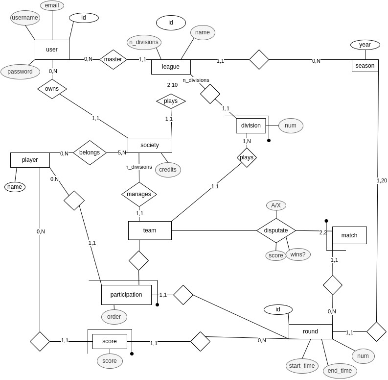

# Fantasy tabletennis
One project, one monorepo, 3 modules, 3 build system

> [!IMPORTANT]  
> Very WIP, just an idea for now.

## info

read the docs (in /docs).

## A simple scraper for the fitet result portal
Not so simple in the end, features:
- multithreading (more than 20 threads takes down the website)
- persistency (data are saved in a relational db, for a complete list just look 
at [sqlalchemy](https://sqlalchemy.org))
- db update operation optimization
- cli utility
- json saving option (there should be a tag to the right commit)

TODO:
- [ ] web ui for fantasy tabletennis
- [ ] player auction
- [ ] formation management (choose 3 players) 
- [ ] score assignement (shoud think about something smart)
- [ ] match simulation (A-X and score comparison)
- [ ] update fitet parser request discharging (some tournaments are present 
but not completely updated)
 
https://github.com/NixOS/nixpkgs/blob/c1f0be03736e6d5ab4d19e867e6684686203eee8/pkgs/games/mindustry/default.nix#L127
https://www.baeldung.com/spring-mvc-static-resources
